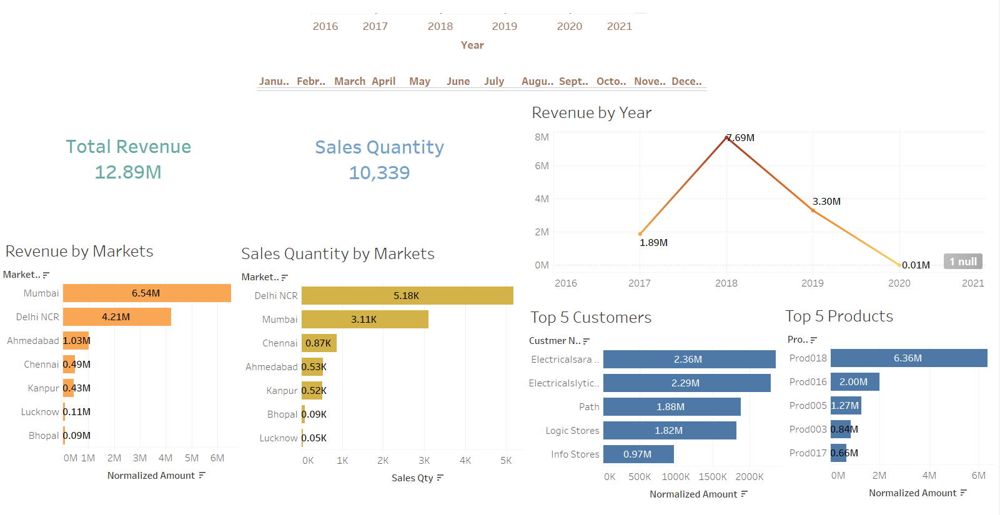
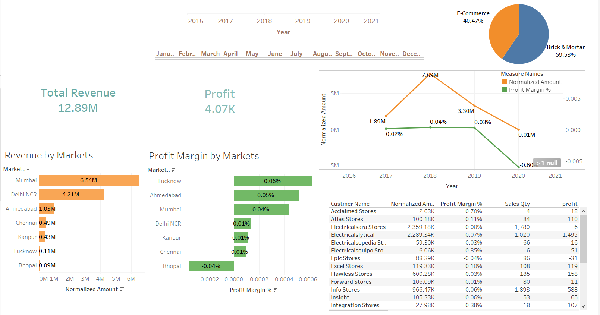

# 📊 Sales Insights - Data Analysis using Tableau & SQL

<div align="center">
  
  
  
  
  
  
  [](https://opensource.org/licenses/MIT)
  
  
  
  **Transform raw sales data into actionable business intelligence**
  
  [View Demo](https://public.tableau.com/views/SalesInsights-DataAnalysisProject/) · [Report Bug](https://github.com/yourusername/Sales-Insights-Data-Analysis-using-Tableau-and-SQL/issues) · [Request Feature](https://github.com/yourusername/Sales-Insights-Data-Analysis-using-Tableau-and-SQL/issues)

</div>

---

## 🎯 Project Overview

This project delivers **comprehensive sales analytics** for an India-based computer hardware company facing challenges in tracking sales performance in a dynamically growing market. By leveraging **SQL for ETL processes** and **Tableau for visualization**, this solution transforms complex sales data into intuitive, actionable insights.

### 🔍 Business Context
The hardware company's sales director struggles to gain real-time insights from regional managers across India. This project automates the insight generation process, replacing manual Excel reports with dynamic, interactive dashboards that reveal:
- 📈 Revenue trends by city and time periods
- 🏆 Top-performing customers and products  
- 💰 Profit margins and analysis
- 📊 Market-specific performance metrics

---

## ✨ Key Features

<table>
  <tr>
    <td align="center">📥</td>
    <td><b>Automated ETL Pipeline</b><br/>SQL-based data extraction and transformation into star schema for optimized analytics</td>
  </tr>
  <tr>
    <td align="center">📊</td>
    <td><b>Interactive Dashboards</b><br/>Two comprehensive Tableau dashboards for Revenue and Profit Analysis</td>
  </tr>
  <tr>
    <td align="center">💡</td>
    <td><b>Real-time Insights</b><br/>Instant visibility into sales performance across multiple dimensions</td>
  </tr>
  <tr>
    <td align="center">🎨</td>
    <td><b>Professional Visualizations</b><br/>Clean, intuitive charts and graphs for executive-level reporting</td>
  </tr>
  <tr>
    <td align="center">🔄</td>
    <td><b>Flexible Data Sources</b><br/>Support for both MySQL database and Excel file inputs</td>
  </tr>
</table>

---

## 🛠️ Technology Stack

- **Database:** MySQL 8.0+ / SQL Server
- **Visualization:** Tableau Public/Desktop 2021.2+
- **Data Processing:** SQL (DDL, DML, Joins, CTEs)
- **Data Sources:** Excel, CSV
- **Analytics:** Statistical Analysis, Business Intelligence

---

## 📋 Prerequisites

Before you begin, ensure you have the following installed:

- ✅ **MySQL** (8.0 or higher) or **SQL Server**
- ✅ **Tableau Public** (free) or **Tableau Desktop** (trial available)
- ✅ **MySQL Workbench** (optional, for easier database management)
- ✅ 4GB RAM minimum (8GB recommended for smooth performance)

---

## 🚀 Getting Started

### Step 1: Clone the Repository

```bash
git clone https://github.com/yourusername/Sales-Insights-Data-Analysis-using-Tableau-and-SQL.git
cd Sales-Insights-Data-Analysis-using-Tableau-and-SQL
```

### Step 2: Set Up the Database

#### Option A: Using MySQL (Recommended)

1. **Import the database dump:**
```sql
mysql -u your_username -p
CREATE DATABASE sales_insights;
USE sales_insights;
SOURCE path/to/db_dump.sql;
```

2. **Verify the import:**
```sql
SHOW TABLES;
-- Should display: customers, date, markets, products, transactions
```

#### Option B: Using Excel
- Simply use the provided `db_dump.xlsx` file directly in Tableau

### Step 3: Connect Tableau to Your Data

1. **Launch Tableau** (Public or Desktop)
2. **Connect to Data Source:**
   - For MySQL: Server → MySQL → Enter credentials
   - For Excel: File → Microsoft Excel → Select `db_dump.xlsx`
3. **Open the provided workbook:** `Sales Insights - Data Analysis Project using Tableau.twbx`

---

## 📊 Dashboard Showcase

### 💰 Revenue Analysis Dashboard
<div align="center">
  
  <br><em>Track revenue trends, top customers, and product performance</em>
</div>

**Key Metrics:**
- Total Revenue by Year/Quarter/Month
- Revenue by Markets and Customers
- Top 5 Customers & Products
- Revenue Trend Analysis

### 📈 Profit Analysis Dashboard
<div align="center">
  
  <br><em>Monitor profit margins and identify optimization opportunities</em>
</div>

**Key Metrics:**
- Profit Margin by Market
- Profit Trend Analysis
- Customer Contribution to Profit
- Product Profitability Matrix

🔗 **[View Live Dashboard on Tableau Public](https://public.tableau.com/views/SalesInsights-DataAnalysisProject/)**

---

## 🗄️ Data Model

The project implements a **star schema** for optimal query performance:

<div align="center">
  
  <br><em>Star Schema Implementation in Tableau</em>
</div>

```
┌─────────────┐
│ TRANSACTIONS│ (Fact Table)
└──────┬──────┘
       │
   ┌───┼───┬──────┬──────┐
   │   │   │      │      │
┌──▼─┐ ▼  ┌▼─┐  ┌▼──┐ ┌─▼──────┐
│DATE│   │CUSTOMER│ │PRODUCT│ │MARKETS│
└────┘   └────────┘ └───────┘ └────────┘
```

---

## 💻 SQL Query Examples

### Basic Queries

```sql
-- 1. Show all customer records
SELECT * FROM customers;

-- 2. Total transactions in Chennai market
SELECT COUNT(*) FROM transactions 
WHERE market_code='Mark001';

-- 3. Distinct products sold in Chennai
SELECT DISTINCT product_code 
FROM transactions 
WHERE market_code='Mark001';
```

### Advanced Analytics Queries

```sql
-- 4. Revenue for year 2020
SELECT SUM(t.sales_amount) as total_revenue_2020
FROM transactions t
INNER JOIN date d ON t.order_date = d.date
WHERE d.year = 2020 
  AND (t.currency = 'INR' OR t.currency = 'USD');

-- 5. Top 5 customers by revenue
SELECT c.custmer_name, 
       SUM(t.sales_amount) as total_revenue
FROM transactions t
INNER JOIN customers c ON t.customer_code = c.customer_code
GROUP BY c.customer_code, c.custmer_name
ORDER BY total_revenue DESC
LIMIT 5;

-- 6. Monthly revenue trend for 2020
SELECT d.month_name,
       SUM(t.sales_amount) as monthly_revenue
FROM transactions t
INNER JOIN date d ON t.order_date = d.date
WHERE d.year = 2020
GROUP BY d.month_name, d.month_number
ORDER BY d.month_number;
```

---

## 📁 Project Structure

```
Sales-Insights-Data-Analysis/
│
├── 📂 data/
│   ├── db_dump.sql          # MySQL database dump
│   └── db_dump.xlsx         # Excel alternative
│
├── 📂 tableau/
│   └── Sales Insights.twbx  # Tableau workbook
│
├── 📂 sql/
│   ├── schema.sql           # Database schema
│   ├── queries.sql          # Sample queries
│   └── etl_process.sql      # ETL transformations
│
├── 📂 images/
│   ├── revenue-dashboard.png
│   ├── profit-dashboard.png
│   └── star-schema.png
│
├── 📄 README.md
└── 📄 LICENSE
```

---

## 🎯 Business Impact

This solution delivers significant value:

- **⏱️ Time Savings:** Reduces reporting time from hours to seconds
- **📊 Data Accuracy:** Eliminates manual Excel errors
- **💡 Actionable Insights:** Identifies revenue opportunities and cost optimization areas
- **📈 Performance Tracking:** Real-time monitoring of KPIs
- **🎯 Strategic Decisions:** Data-driven decision making for sales strategy

---

## 🤝 Contributing

Contributions make the open-source community an amazing place to learn, inspire, and create. Any contributions you make are **greatly appreciated**.

1. Fork the Project
2. Create your Feature Branch (`git checkout -b feature/AmazingFeature`)
3. Commit your Changes (`git commit -m 'Add some AmazingFeature'`)
4. Push to the Branch (`git push origin feature/AmazingFeature`)
5. Open a Pull Request

---

## 📚 Learning Resources

- [Tableau Public Training](https://public.tableau.com/en-us/s/resources)
- [MySQL Tutorial](https://dev.mysql.com/doc/mysql-tutorial-excerpt/5.7/en/)
- [Star Schema Design](https://www.kimballgroup.com/data-warehouse-business-intelligence-resources/kimball-techniques/dimensional-modeling-techniques/)
- [SQL for Data Analysis](https://mode.com/sql-tutorial/)

---

## 📝 License

This project is licensed under the MIT License - see the [LICENSE](LICENSE) file for details.

---

## 👤 Author

**VIKRAM KAVURI**

- GitHub: [@vikramkavuri](https://github.com/yourusername)
- LinkedIn: [VIKRAM KAVURI](https://linkedin.com/in/yourusername)
- Email: vikram.kavuri@email.com

---

## 🙏 Acknowledgments

- Thanks to the Tableau community for visualization best practices
- Inspired by real-world business intelligence challenges
- Special thanks to all contributors and stargazers

---

<div align="center">
  
### ⭐ Star this repository if you found it helpful!
  
Made with ❤️ by **VIKRAM KAVURI**

</div>